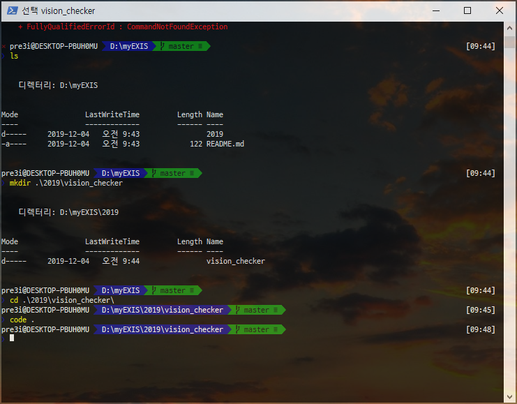
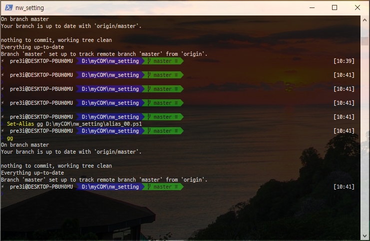

* nw_setting
* windows 10 에서 나만의 컴퓨터 셋팅

|||
|:---:|:---|
|ps|[chocolatey--git](#installing-chocolatey--git)|
|ps|[oh-my-posh](#oh-my-posh)|
|ps|[alias-setting](#alias-setting)|
|ps|[wsl2](#wsl2)|


# Windows 10


## PowerShell


현재 나의 powershell version
* Version : 5.1.18362.145

```powershell
get-host
```


### Installing Chocolatey & git


* https://git-scm.com/book/en/v2/Appendix-A%3A-Git-in-Other-Environments-Git-in-PowerShell


gitbash 불편함 해소하고 설치 오류 해소하기 위해 coocolatey로 git 설치하기

```powershell
Set-ExecutionPolicy Bypass -Scope Process -Force; iex ((New-Object System.Net.WebClient).DownloadString('https://chocolatey.org/install.ps1'))
choco install git -y
```


### oh-my-posh

* https://medium.com/rkttu/use-windows10-open-ssh-tips-e6e9c77de433

powershell 멋지게 셋팅하기

하고 나면 이렇게됨




```powershell
Install-Module posh-git -Scope CurrentUser
Install-Module oh-my-posh -Scope CurrentUser
```

안되면 이거
```powershell
Install-Module PowerShellGet -Force -SkipPublisherCheck
```


시작시 자동시작 셋팅
```powershell
if (!(Test-Path -Path $PROFILE )) { New-Item -Type File -Path $PROFILE -Force }
notepad.exe $PROFILE
```

스크립트에 입력
```text notepad
Import-Module posh-git
Import-Module oh-my-posh
Set-Theme Paradox
```

설정 마무리

```powershell
Set-ExecutionPolicy -Scope LocalMachine -ExecutionPolicy RemoteSigned -Force
```

```powershell
Install-Module posh-git -Scope CurrentUser -Force
Install-Module posh-git -Scope CurrentUser -AllowPrerelease -Force
```


### alias setting

```powershell
get-alias
```
이거치면 alias 설정되어 있는 목록 출력. 생각보다 좋은게 많음

예를 들면 

```powershell
gl
```

이건 `linux`의 `pwd` 같은거


```powershell
Set-Alias [뭐로] [어떤걸]
```

#### my Alias list

가장 귀찮은.. `git add`, `git commit` `git push`...  필요하지만... 귀찮다... 

그래서 shell script 만들어서 컴 끌때, 또는 `alias` 입력하면 내 git repo들 몽땅 전부 `add` 해서 push 까지 넣어버리자.

commit 에 남길 내용으로 현재 날짜? 현재 시간? 이런 시간 정보를 넣을까 했지만 이미 git 정보에 알아서 남아지므로.... 일단 `"auto"` ... 이렇게라도 남겨놓자


원하는 위치에 shell script 생성

```powershell
notepad alias_00.ps1
```

linux 였다면 자연스럽게 vim을 썼었을텐데... 일단 메모장(notepad)로 원하는 파일명 (alias_00)을 적고 확장자는 `ps1` 로. 이건 `.sh` linux shell 파일과 같은거


```notepad
cd D:\myCOM\nw_setting

git add .
git commit -m "auto"
git push -u origin master
```

원하는 `git repo`에 `.git`이 있는 위치로 현재 폴더 위치 이동시킨 후 `add` `commit` `push` 차례로 실행

이렇게 하고 저장한 뒤에 먼저 컴퓨터에 *git config 작성해 넣어야 함.*

```bash
  git config --global user.email "you@example.com"
  git config --global user.name "Your Name"
```

이제 테스트 삼아 아까 만들어 놓은 `.ps1` 파일을 실행해보기 위해서 

```powershell
./alias_00.ps1
```

실행해보면 이상없이 잘 될꺼임.

이제 이걸 alias로 setting해서 넣기위해 


```powershell
Set-Alias gg D:\myCOM\nw_setting\alias_00.ps1
```

`gg` 명령어를 넣으면 `D:\myCOM\nw_setting\alias_00.ps1` 이 위치에 이 파일을 실행하자~~~

그럼 잘 된다~




> 근데 생각해보니까 그냥 vscode에 git 확장모듈 깔아놓으면 그냥 버튼 한번이면 되는거 아니었?................


## PICKPICK

https://picpick.app/ko/start?download=kr

##  WSL2

https://docs.microsoft.com/en-us/windows/wsl/wsl2-install

기본 윈도우10 설치하면 빌드가 18363.x 근데 wsl2 사용하려면 18383.??  어쨌든 훨 높아야 하는데 업데으로 갈 수 있는 한계가 있음. 그래서 preview 버전 신청해서 테스트보드 windows 되어야함.

TODO
다른 깃에 있는 설정법 옮겨넣기


