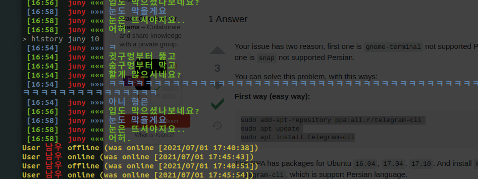

# Linux - Ubuntu


|N|index|
|:---:|:---|
||[themes](./src/linux/ubuntu-themes.md)|
||[ubuntu on google drive](./src/linux/ubuntu-on-google-drive.md)|
||videos|
||telegram-cli|


---

## videos

영상관련

### ffmpeg

```bash
ffmpeg -codecs


ffmpeg -i origin.mp4 -acodec copy -vcodec copy -ss 30 -t 50 t.mp4

```

* [ref](https://pinedance.github.io/blog/2016/07/02/split-video-file)

### kdenlive

* [영상편집](https://kdenlive.org/en/download/)
    * [ref](https://hkebi.tistory.com/957)


### synology

https://kurukurucoding.tistory.com/41


## telegram-cli

저렇게 한쪽에 켜놓고 싶은게 아니고 그냥 터미널에서 alias로 메시지만 보내고 받은것만 바로바로 뜨게 처리하고 싶은거였는데....




이렇게 alias 넣고 해도 메시지만 안가고 있다. 또 그냥 telegram-cli 창 켜놓고 msg 로 보내면 한글이 깨질때가 대부분이고 또 어쩔때는 한글이 될때도 있다....


```
alias msg='telegram-cli -W -e '\''msg juny $1'\'''
```

결국 1시간 삽질하다 포기..  (간 자는 또 vscode 에서 안써지지?)


```
#sudo add-apt-repository ppa:ali.r/telegram-cli
#sudo apt update

sudo apt install telegram-cli
```


